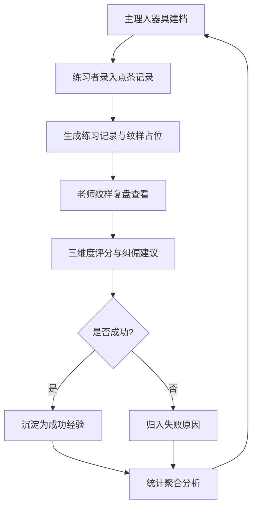

# 宋式点茶练习与茶百戏纹样复现平台 — 产品需求文档（PRD）

## 1. 产品概述

本平台为宋式点茶技艺传承而设，面向主理人、练习者与点评老师三类角色，围绕"器具建档 → 点茶记录 → 纹样复盘 → 点评沉淀"的传统技艺训练闭环，沉淀不同茶样在不同手法下的成功经验，让茶百戏纹样的复现从偶得走向可复现、可教学、可积累。

- 解决问题：传统点茶练习依赖口传心授，记录零散、复盘缺失、经验难以沉淀
- 目标用户：茶道工作室主理人、点茶练习者、点茶教学老师
- 市场价值：建立可量化的茶汤质量评估体系，助力非遗技艺的数字化传承

## 2. 核心功能

### 2.1 用户角色

| 角色 | 进入方式 | 核心权限 |
|------|----------|----------|
| 主理人 | 工作室授权 | 器具档案建档与管理（茶样/茶盏/茶筅/注汤手法） |
| 练习者 | 姓名登记 | 录入点茶练习记录、查看复盘与点评 |
| 老师 | 工作室授权 | 评分纠偏、沉淀成功经验、统计查看 |

> 说明：本平台为工作室内部训练系统，不做公开注册，角色通过页面内切换身份实现演示。

### 2.2 功能模块

1. **器具档案页**：茶样、茶盏、茶筅、注汤手法四类器具/手法建档与浏览
2. **练习记录页**：点茶记录录入（茶粉克数、注水轮次、击拂时长、沫饽状态、纹样占位）与列表
3. **纹样复盘页**：单次练习纹样照片占位与细节复盘回看
4. **点评反馈页**：老师按"汤花细腻度""咬盏时长""纹样完整度"三维度评分与纠偏建议
5. **统计页**：各茶样成功率、常见失败原因、纹样复现稳定度、练习时长分布
6. **首页/闭环看板**：展示训练闭环全貌与经验沉淀入口

### 2.3 页面详情

| 页面名称 | 模块名称 | 功能描述 |
|----------|----------|----------|
| 首页 | 闭环看板 | 展示器具建档→点茶记录→纹样复盘→点评沉淀四步闭环，关键数据概览 |
| 器具档案 | 茶样档案 | 茶样名称、产地、焙火度、研磨细度、年份、备注的增删改查 |
| 器具档案 | 茶盏档案 | 茶盏名称、窑口、釉色、容量、备注的增删改查 |
| 器具档案 | 茶筅档案 | 茶茶筅名称、筅穗数、材质、使用年限、备注的增删改查 |
| 器具档案 | 注汤手法 | 手法名称、水温、注水速度、手法描述的增删改查 |
| 练习记录 | 记录录入 | 选择茶样/茶盏/茶筅/手法，录入茶粉克数、注水轮次、击拂时长、沫饽状态、纹样描述 |
| 练习记录 | 记录列表 | 按时间/茶样/成功状态筛选，展示练习记录卡片 |
| 纹样复盘 | 纹样详情 | 纹样照片占位（SVG纹样占位图）、手法参数回看、练习者自述 |
| 纹样复盘 | 纹样画廊 | 纹样缩略图墙，按茶样/成功状态筛选浏览 |
| 点评反馈 | 待点评列表 | 展示未点评的练习记录，老师进入点评 |
| 点评反馈 | 点评表单 | 三维度评分（滑块）、纠偏建议（文本）、成功/失败标记 |
| 点评反馈 | 经验沉淀 | 老师勾选沉淀为成功经验，填写关键要点 |
| 统计 | 茶样成功率 | 各茶样练习成功率柱状图 |
| 统计 | 失败原因 | 常见失败原因占比（沫饽粗散/咬盏短/纹样断裂等） |
| 统计 | 复现稳定度 | 同茶样+同手法的评分稳定性（标准差） |
| 统计 | 时长分布 | 练习时长区间分布直方图 |

## 3. 核心流程

### 3.1 文字流程

主理人为茶样、茶盏、茶筅、注汤手法分别建档 → 练习者发起一次点茶，选择器具与手法，录入茶粉克数、注水轮次、击拂时长、沫饽状态与纹样描述，生成练习记录 → 老师在纹样复盘中查看纹样与参数，按汤花细腻度、咬盏时长、纹样完整度三维度评分并给出纠偏建议，标记成功/失败 → 成功经验沉淀到对应"茶样+手法"组合 → 统计页自动聚合成功率、失败原因、复现稳定度与时长分布，反哺下一轮练习。

### 3.2 流程图

## 4. 用户界面设计

### 4.1 设计风格

- **主题方向**：宋式文人书斋——沉静、雅致、留白，追求"淡而有味"的东方美学
- **主色**：墨黑 `#1C1A17`（沉稳底色）、茶纸白 `#F4ECDD`（宣纸质感背景）
- **辅色**：茶汤绿 `#7C8C5E`（汤花与成功）、朱砂红 `#B23A2E`（印章与警示）、鎏金 `#B8924A`（点缀与强调）
- **按钮风格**：圆角矩形（6px），主按钮墨黑底白字，次按钮茶纸底墨字描边，悬浮微抬升
- **字体**：标题用 `Noto Serif SC`（宋体衬线，体现书卷气），正文用 `Noto Sans SC`（黑体，清晰易读）
- **布局风格**：左右分栏 + 卡片式，顶部导航，大量留白，竖向流动如长卷
- **图标/纹样**：使用 `lucide-react` 功能图标，纹样占位以 SVG 绘制茶汤涟漪与沫饽肌理
- **装饰元素**：朱砂印章式标签、宣纸纹理背景、茶汤涟漪分隔线

### 4.2 页面设计概览

| 页面名称 | 模块名称 | UI 元素 |
|----------|----------|----------|
| 首页 | 闭环看板 | 墨黑顶栏，四步闭环横向时间轴，关键数据卡片，茶汤绿强调 |
| 器具档案 | 四类档案标签 | 顶部 Tab 切换，卡片网格，鎏金标签，悬浮抬升 |
| 练习记录 | 录入表单 | 左侧表单（滑块+数字输入），右侧实时预览，茶纸白卡片 |
| 练习记录 | 记录列表 | 卡片列表，朱砂印章状态标签，时间轴排列 |
| 纹样复盘 | 纹样详情 | 居中 SVG 纹样占位，四周参数环绕，底部自述 |
| 纹样复盘 | 纹样画廊 | 网格缩略图墙，悬浮放大，茶汤涟漪边框 |
| 点评反馈 | 点评表单 | 三维度滑块（汤花/咬盏/纹样），纠偏建议文本框，印章式提交 |
| 统计 | 图表区 | 柱状图、占比环图、直方图，茶汤绿/朱砂红双色系 |

### 4.3 响应式

- 桌面优先（1280px+），适配平板（768px+），移动端基础可用
- 表格在窄屏转为卡片堆叠，图表保持可读性

## 5. 非功能性要求

- 前端端口 9551，后端端口 9552
- 数据持久化使用 SQLite，便于工作室本地部署
- 所有列表支持筛选与分页
- 纹样照片以 SVG 占位图呈现，不依赖外部图床
