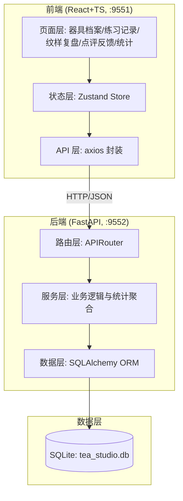
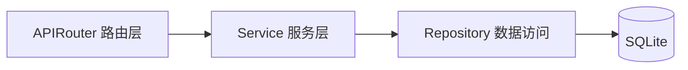
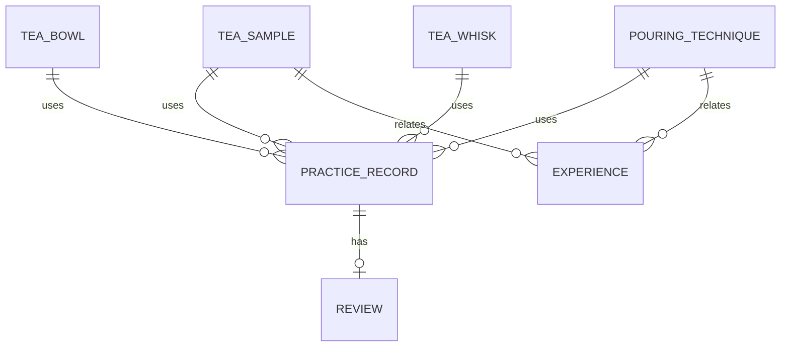

# 宋式点茶练习与茶百戏纹样复现平台 — 技术架构文档

## 1. 架构设计



## 2. 技术选型

- **前端**：React@18 + TypeScript + Vite + TailwindCSS + Zustand + react-router-dom + recharts（图表）+ lucide-react（图标）
- **初始化工具**：vite-init（react-ts 模板）
- **后端**：FastAPI + SQLAlchemy + Pydantic + Uvicorn
- **数据库**：SQLite（本地文件 `tea_studio.db`）
- **包管理**：前端 pnpm / npm，后端 pip + venv

## 3. 路由定义

| 路由 | 页面 | 说明 |
|------|------|------|
| `/` | 首页 | 训练闭环看板与关键数据 |
| `/archive` | 器具档案 | 四类档案 Tab 管理 |
| `/records` | 练习记录 | 记录列表与录入 |
| `/records/:id` | 纹样复盘 | 单条记录纹样复盘 |
| `/review` | 点评反馈 | 待点评列表与点评表单 |
| `/stats` | 统计 | 各维度统计图表 |
| `/experience` | 经验沉淀 | 成功经验浏览 |

## 4. API 定义

### 4.1 器具档案

| 方法 | 路径 | 说明 |
|------|------|------|
| GET | `/api/tea-samples` | 茶样列表 |
| POST | `/api/tea-samples` | 新增茶样 |
| PUT | `/api/tea-samples/{id}` | 更新茶样 |
| DELETE | `/api/tea-samples/{id}` | 删除茶样 |
| GET | `/api/tea-bowls` | 茶盏列表 |
| POST | `/api/tea-bowls` | 新增茶盏 |
| PUT | `/api/tea-bowls/{id}` | 更新茶盏 |
| DELETE | `/api/tea-bowls/{id}` | 删除茶盏 |
| GET | `/api/tea-whisks` | 茶筅列表 |
| POST | `/api/tea-whisks` | 新增茶筅 |
| PUT | `/api/tea-whisks/{id}` | 更新茶筅 |
| DELETE | `/api/tea-whisks/{id}` | 删除茶筅 |
| GET | `/api/pouring-techniques` | 注汤手法列表 |
| POST | `/api/pouring-techniques` | 新增手法 |
| PUT | `/api/pouring-techniques/{id}` | 更新手法 |
| DELETE | `/api/pouring-techniques/{id}` | 删除手法 |

### 4.2 练习记录与点评

| 方法 | 路径 | 说明 |
|------|------|------|
| GET | `/api/practice-records` | 练习记录列表（支持筛选） |
| POST | `/api/practice-records` | 新建练习记录 |
| GET | `/api/practice-records/{id}` | 单条记录详情（含点评） |
| DELETE | `/api/practice-records/{id}` | 删除练习记录 |
| GET | `/api/reviews` | 点评列表（支持 pending 筛选） |
| POST | `/api/reviews` | 新建点评（三维度评分+纠偏） |

### 4.3 经验沉淀与统计

| 方法 | 路径 | 说明 |
|------|------|------|
| GET | `/api/experiences` | 成功经验列表 |
| POST | `/api/experiences` | 沉淀一条成功经验 |
| GET | `/api/statistics/overview` | 总览（记录数、成功率等） |
| GET | `/api/statistics/tea-sample-success` | 各茶样成功率 |
| GET | `/api/statistics/failure-reasons` | 常见失败原因占比 |
| GET | `/api/statistics/pattern-stability` | 纹样复现稳定度 |
| GET | `/api/statistics/duration-distribution` | 练习时长分布 |

## 5. 服务端架构图



## 6. 数据模型

### 6.1 ER 图



### 6.2 表结构定义

```sql
-- 茶样
CREATE TABLE tea_sample (
    id INTEGER PRIMARY KEY AUTOINCREMENT,
    name TEXT NOT NULL,
    origin TEXT,
    roast_level TEXT,
    grind_fineness TEXT,
    year INTEGER,
    notes TEXT,
    created_at TEXT DEFAULT (datetime('now'))
);

-- 茶盏
CREATE TABLE tea_bowl (
    id INTEGER PRIMARY KEY AUTOINCREMENT,
    name TEXT NOT NULL,
    kiln TEXT,
    glaze TEXT,
    capacity_ml INTEGER,
    notes TEXT,
    created_at TEXT DEFAULT (datetime('now'))
);

-- 茶筅
CREATE TABLE tea_whisk (
    id INTEGER PRIMARY KEY AUTOINCREMENT,
    name TEXT NOT NULL,
    prong_count INTEGER,
    material TEXT,
    age_years REAL,
    notes TEXT,
    created_at TEXT DEFAULT (datetime('now'))
);

-- 注汤手法
CREATE TABLE pouring_technique (
    id INTEGER PRIMARY KEY AUTOINCREMENT,
    name TEXT NOT NULL,
    water_temp_c INTEGER,
    pour_speed TEXT,
    description TEXT,
    created_at TEXT DEFAULT (datetime('now'))
);

-- 练习记录
CREATE TABLE practice_record (
    id INTEGER PRIMARY KEY AUTOINCREMENT,
    practitioner_name TEXT NOT NULL,
    tea_sample_id INTEGER NOT NULL,
    tea_bowl_id INTEGER NOT NULL,
    tea_whisk_id INTEGER NOT NULL,
    technique_id INTEGER NOT NULL,
    tea_powder_grams REAL NOT NULL,
    water_pour_rounds INTEGER NOT NULL,
    whisking_duration_sec INTEGER NOT NULL,
    foam_state TEXT NOT NULL,
    pattern_description TEXT,
    pattern_seed INTEGER,
    created_at TEXT DEFAULT (datetime('now')),
    FOREIGN KEY (tea_sample_id) REFERENCES tea_sample(id),
    FOREIGN KEY (tea_bowl_id) REFERENCES tea_bowl(id),
    FOREIGN KEY (tea_whisk_id) REFERENCES tea_whisk(id),
    FOREIGN KEY (technique_id) REFERENCES pouring_technique(id)
);

-- 点评反馈
CREATE TABLE review (
    id INTEGER PRIMARY KEY AUTOINCREMENT,
    practice_record_id INTEGER NOT NULL,
    teacher_name TEXT NOT NULL,
    foam_delicacy_score INTEGER NOT NULL,
    cup_biting_duration_sec INTEGER NOT NULL,
    pattern_completeness_score INTEGER NOT NULL,
    correction_suggestion TEXT,
    is_successful INTEGER NOT NULL,
    failure_reason TEXT,
    created_at TEXT DEFAULT (datetime('now')),
    FOREIGN KEY (practice_record_id) REFERENCES practice_record(id)
);

-- 经验沉淀
CREATE TABLE experience (
    id INTEGER PRIMARY KEY AUTOINCREMENT,
    tea_sample_id INTEGER NOT NULL,
    technique_id INTEGER NOT NULL,
    summary TEXT NOT NULL,
    key_points TEXT,
    success_count INTEGER DEFAULT 0,
    total_count INTEGER DEFAULT 0,
    created_at TEXT DEFAULT (datetime('now')),
    FOREIGN KEY (tea_sample_id) REFERENCES tea_sample(id),
    FOREIGN KEY (technique_id) REFERENCES pouring_technique(id)
);
```

### 6.3 初始种子数据

系统启动时自动写入示例茶样（白茶、龙团、抹茶）、茶盏（兔毫盏、油滴盏）、茶筅（七十二穗筅）、注汤手法（高冲低斟、环绕注汤），以及若干练习记录与点评，便于演示。
